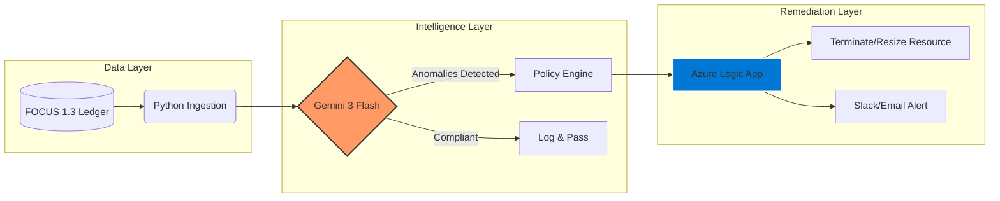

# 🛡️ Sentinel-1: Autonomous AI-FinOps Governance Engine

**Bridging the gap between Cloud Financial Operations and Autonomous Remediation through Agentic AI.**

---

## 🚀 Executive Summary
**Sentinel-1** is an autonomous governance framework designed to move FinOps from "Reporting" to "Remediation." By utilizing **Gemini 3 Flash** to reason over normalized **FOCUS 1.3** billing data, the engine detects cost anomalies and executes automated "kill-signals" through Azure Logic Apps. This ensures that cloud environments remain within strict budgetary and compliance boundaries without manual intervention.

---

## 🏗️ Technical Architecture

* **Ingestion Layer**: Consumes multi-cloud billing exports normalized to the **FOCUS 1.3** open standard.
* **AI Inference Layer**: Employs LLM-based reasoning to identify complex cost variances and "zombie" resources that traditional threshold-based monitors fail to capture.
* **Remediation Handshake**: An event-driven bridge between the AI core and **Azure Logic Apps** to pause, resize, or terminate non-compliant cloud resources automatically.

---

## 🛠️ Technology Stack

* **Reasoning Agent**: Gemini 3 Flash (Agentic AI)
* **Data Governance**: FOCUS 1.3 (FinOps Open Cost & Usage Specification)
* **Automation**: Azure Logic Apps / Python 3.10+
* **Security**: Secret Management via Environment Variables (`python-dotenv`)

---

## 📂 Repository Structure

To ensure enterprise-grade security, this repository follows a modular structure:

* **core/**: `sentinel_audit_engine.py` — The sanitized AI reasoning agent.
* **integrations/**: `remediation_handler.py` — Infrastructure communication and action-validation logic.
* **schemas/**: `focus_contract.json` — Definition for normalized input ingestion.

---

## 🔒 Security & Privacy Notice
* **Sanitized Core**: This public repository provides the architectural framework and sanitized Python logic to protect proprietary prompt chaining.
* **Secret Management**: All API keys and endpoint URLs are managed via environment variables and are strictly excluded from version control.
* **Technical Deep-Dives**: Full production walkthroughs and detailed logic flow reviews are available for technical interviews.

---

## 👔 Professional Profile
**AI FinOps Lead | Platform Architect** Specializing in the intersection of AI Architecture and Cloud Financial Operations for global remote teams.

* **LinkedIn**: [YOUR_LINK_HERE]
* **Focus Areas**: FinOps Strategy, Autonomous Governance, Multi-Cloud Architecture.
